### Table of Contents

- [Arduino StarterKit for IoT-Activation](#arduino-starterkit-for-iot-activation)
  * [What is Arduino?](#what-is-arduino-)
- [Getting started with your Arduino](#getting-started-with-your-arduino)
  * [Arduino IDE](#configure-arduino-ide)
  * [Arduino web editor](#use-arduino-web-editor)
  * [Hello World: Create your first Arduino program](#hello-world-create-your-first-arduino-program)
  * [NB-IoT and LTE-M: Setup and Connection](#nb-iot-and-lte-m-setup-and-connection)

# Arduino StarterKit for IoT-Activation

## What is Arduino?
Arduino is an open-source electronics platform based on easy-to-use hardware. 
The Arduino software is easy for beginners and flexible enough for advanced users.

### Arduino MKR NB-1500
The MKR branch of the Arduino board family is dedicated to the IoT solutions. It provides 
solutions for devices in remote locations without a high-speed Internet connection, or in situations where a power source isn't available. 

The Arduino MKR NB 1500 adds wireless connectivity, Narrow Band IoT and LTE CAT M1, to the Arduino family. 
It is a  development board which contains the ATMEL SAMD21 micro controller, 
designed to integrate a low power-consumption core and a high performance.
The MKR NB 1500 brings the Arduino Zero functionalities in a smaller form factor.

<p align="center">
      
</p>


##### LED ON 
This LED is connected to the 5V input from either USB or VIN

##### Reset button 
This button allows you to reset the program contained in the board. It will make it run again from the beginning

##### Onboard LED 
The onboard LED is connected to pin D6 

##### Battery connector 
If you want to connect a battery to your board be sure to attach it a female 2 pin JST PHR2 Type connector.

##### LED charge
The indicator will remain on when the board receives 5V from VIN or USB, and the chip starts charging the Li-Po battery connected to the JST connector. 

##### Antenna connector
Allows you to connect an external antenna to receive and send RF signal

### Arduino Antenna GSM

GSM antennas designed for mobile communications compatible with the Arduino board.

<p align="center">
      
</p>

### Power Supply 
An electrical device that supplies electric power to your Arduino board

<p align="center">
      
</p>


[](#table-of-contents)

### Telefónica SIM Card
This little one makes you enjoy all the advantages of the Telefónica network. 
Take care of it, It will be your partner into the IoT world.

&#x1F4CD;
Note that to insert it into the Arduino board you will need a microSIM.

<p align="center">
      
</p>

[](#table-of-contents)

# Getting started with your Arduino

## Configure Arduino IDE

Arduino platform provides an Integrated Development Environment (IDE). 
The first step to get started with the kit is to download the Arduino IDE from their web https://www.arduino.cc/en/Main/Software

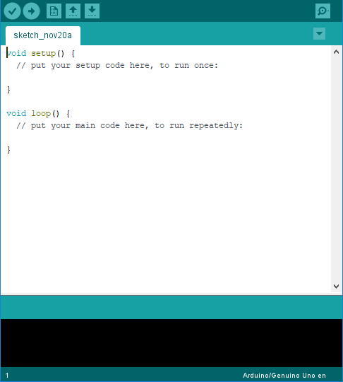

This environment provides not only an interface to develop your scripts. 
It is also your tool to download your files to the device.

This development environment provides support for the different Arduino boards.
For this reason, before loading your software, you must select your board type.
If you want to program your MKR NB 1500 you need to install the Arduino Desktop IDE and add the Atmel SAMD Core. 
This simple procedure is done selecting **Tools** menu, then **Boards** and finally **Boards Manager**, 

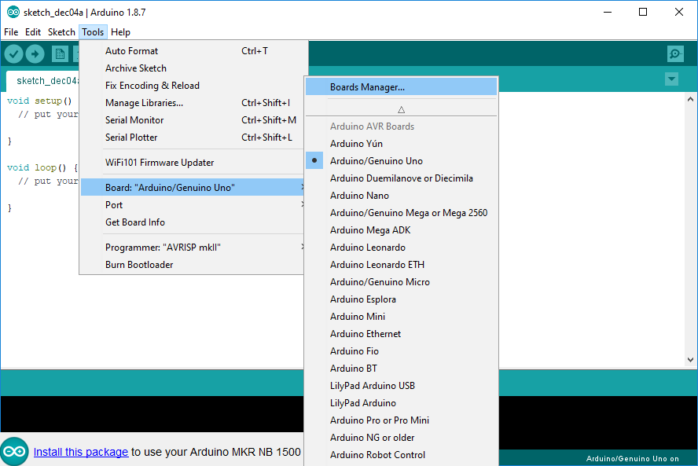

Here you can search MKR NB 1500 to find the core. Click on its box and click the install button. 
Follow the download and install procedure, including the suitable drivers for your operating system to use the board.

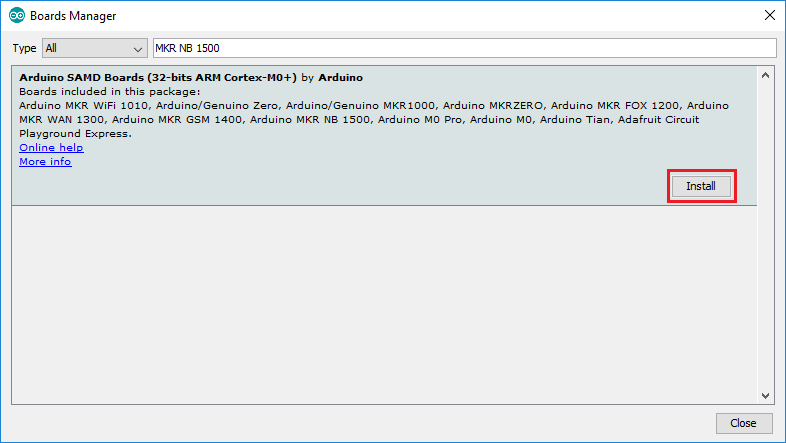

Now that the SAMD Core is installed. NOw you are ready to select the corresponding Board.
Select the entry in the **Tools > Board menu** that matchs to **Arduino MKR NB-1500**.

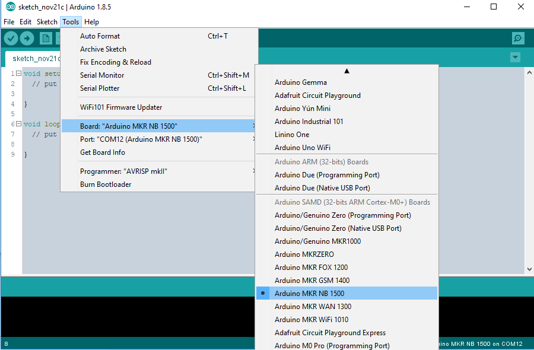

The first time you connect your board, your computer will recognize it as a new device. 
However, you must configure the environment to indicate the port it has been connected.

Connect your board to your computer you need a micro USB cable, and wait until your computer recognizes it.
Select the serial device port from  **Tools > Serial Port menu**. 
It should be something like **COMx** (COM1 and COM2 are usually reserved). 
if you can't find the port used, you should disconnect your board and re-open the menu.
The entry that disappears should be the Arduino board. Reconnect the board and select that serial port.

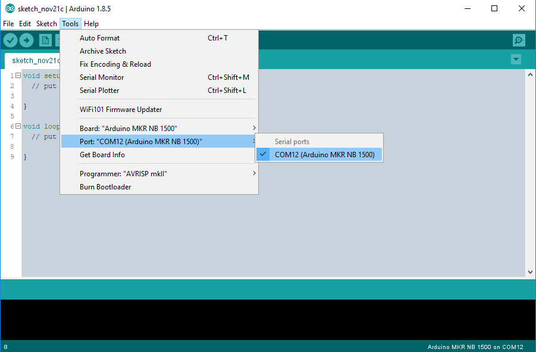

If It is your first time using the board, maybe during the compiling process some libraries could be not found.

To avoid this error  you can import them by following these steps:

Go to the menu **sketch** and select **Include library** to enter the **Manage libraries...**

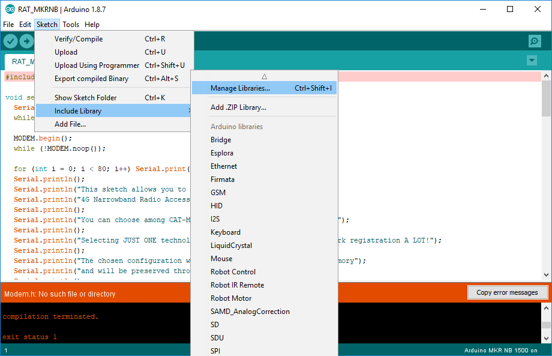

Search by board name **MKR NB** to find the needed libraries.

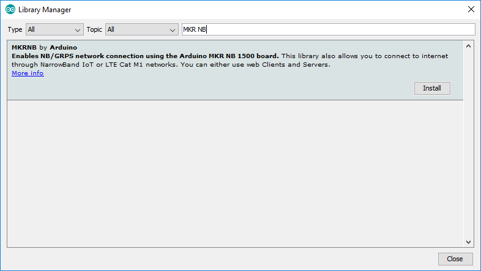

Now everything is ready to run your first script. 

## Use Arduino web editor

Another alternative for development on Arduino boards without download anything, it is the new web editor 
https://create.arduino.cc/editor allowing the same development that on the desktop editor.

If you want to use this online tool, you only need to register on the Arduino website and create a user account.

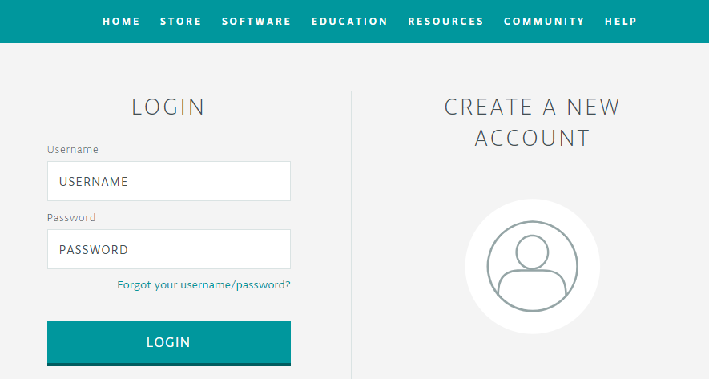

This editor shows a friendly interface with the same functionalities. As you can see in the following screenshot 

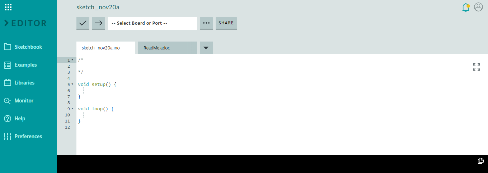

The web editor is ready to use, you have to select your board and make sure you have an internet connection.
Because it will not be necessary to manage the libraries and the boards.

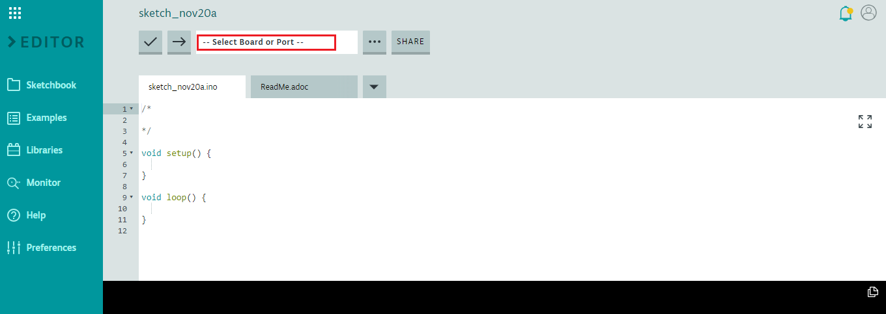

In this case, you should try to find the model of your board, MKR NB 1500

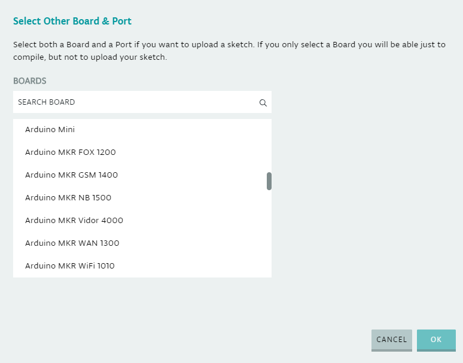

As we mentioned before, you won't need to manage the installed libraries, because the editor has access to the Arduino repository. 
However, it has the same tools to add the available libraries.

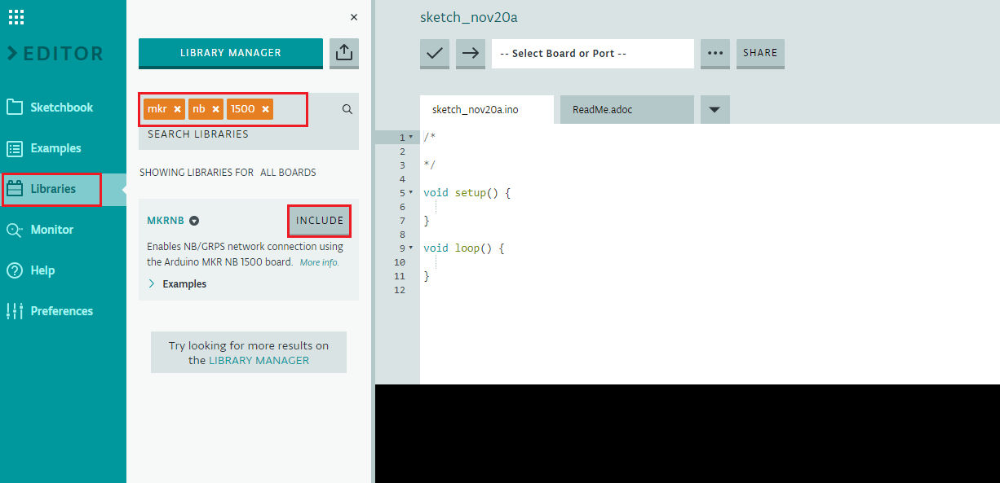

To upload the code to your board, you should follow the same process that you would follow when you were using the IDE, 
however, being an online tool allows new options such as sharing the sketch using a url


[](#table-of-contents)

## Hello World: Create your first Arduino program

The Arduino programming language is based on Wiring, creating a simplified version of the C++ language.

We show you  the typical structure of a program. This structure is created automatically when you open a new file

```c
void setup() {
  // Put your setup code here:
  // This part of the software will run only once when the program is started
  // Use this code to initialize your device
}

void loop() {
  // Put your main code here:
  // This part of the code is repeated constantly
}
```

To run your first program, copy the following code into the Arduino IDE or the web editor

```c
void setup() {
  // put your setup code here, to run once:
  Serial.begin(9600);
  
}

void loop() {
  // put your main code here, to run repeatedly:
  Serial.println(" Hello World ");
  delay(2000);
}
```
Great, you should be able to see something like this.

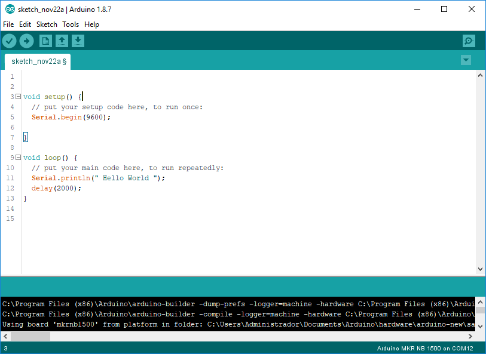

Let's do the last test. Compile and upload your code to the board.
But you're lucky, the IDE will do  this for you. If an error occurs, It will appear at the console below

To do this press the **Upload** button that you will find below the menu. 


If everything goes well, your software is already running on the board, and will restart every time you turn it on.

But what the hell, your Arduino doesn't have a screen where display text!
This is not a problem, as you have previously set up a serial connection to send messages.
So, your board is sending those messages through the USB cable connected to your pc.

Effectively! again your Arduino IDE does it for you.
You can open a terminal to display all messages sent from the Arduino via serial communication.
Click on the lens icon to open it.


Now you can check that the message **"Hello world"** is sent every 2 seconds. 

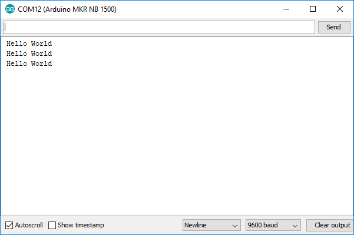

[](#table-of-contents)

## Assembling: Antenna and microSIM 

The Arduino board has a very simple assembly, but make sure you've done it correctly or 
you won't be able to make the connection.

The SIM card must be in microSIM format, and must be fully inserted, with the metal face of the 
connector towards the inside of the board.

To plug-in the GSM antenna, carefully press the connector and lock it in parallel.

## NB-IoT and LTE-M: Setup and Connection 

Now that you've run your first arduino program. You need to learn how to set up the network connection. 
The Arduino board is equipped with a SARA-R410M modem.
It is a Ultra-compact LTE Cat M1 / NB1 and GPRS modules with multi-regional coverage.

Not only allows you to select the type of network you want to connect to, 
but also to prepare the appropriate configuration to connect to the Movistar network in your country.

Arduino will provide you with different examples and tools to perform the initial SARA's module configuration. 
But we'll teach you how to create your own configuration code.So you will be able to run it at the beginning of each new script.

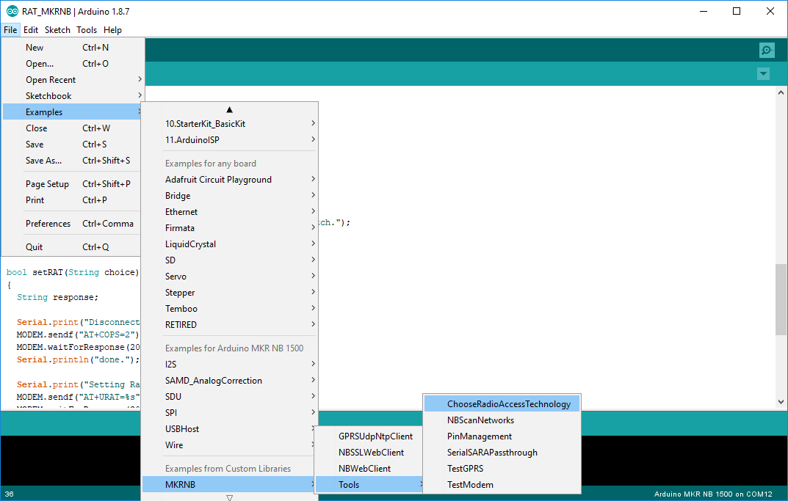

:thumbsup: make sure that you had correctly configure the device before run the program due to the module will maintain 
the previous configuration in the case of not modifying it.

### Setup 

Before preparing the script, you should know that the communication between the board and the module is done 
by a lsit of instructions known as AT commands.

These AT commands allow you, among other options, to select for example if you wanna connect to NB or LTE, or the band configuration the module should connect. This parameters will change according to your country.
 
Here you will learn the basic commands to attach to Telefonica network.

Here you can see an example of a [setup file]
(https://github.com/telefonicaid/iot-activation/blob/master/scripts/Arduino/Connection/setup_SaraR410M_movistar.h), 
but we'll show you what those commands mean and how to select the appropriate parameters.

```c
int apply(){  
  MODEM.send("AT+CFUN=15");
  MODEM.waitForResponse(5000);
  delay(5000);

  do {
    delay(1000);
    MODEM.noop();
  } while (MODEM.waitForResponse(1000) != 1);
   
  return 0;
}

int setup_SaraR410M_movistar(){

  String response;
  MODEM.begin();
  while (!MODEM.noop());

  //// Disconnecting from network
  //MODEM.sendf("AT+COPS=2"); 
  MODEM.sendf("AT+CFUN=0");
  MODEM.waitForResponse(2000);
   

  //// Select Radio Access Technology (RAT)
  //// uncomment only 1 of the 4 options
  
  //// LTE only
  //MODEM.sendf("AT+URAT=7");
  //// NB-IoT only
  //MODEM.sendf("AT+URAT=8");
  //// LTE-M preferred, NB-IoT as failover
  //MODEM.sendf("AT+URAT=7,8"); 
  //// NB-IoT preferred, LTE-M as failover
  MODEM.sendf("AT+URAT=8,7");
  ////wait response
  MODEM.waitForResponse(2000, &response);
  
  //// Select Band bitmask 
  //// configure both masks if necessary (LTE-M and NB-IoT )
  
  //// configure bitmask for LTE-M (Band-20)
  MODEM.sendf("AT+UBANDMASK=0,524288");
  MODEM.waitForResponse(2000, &response);
  //// configure bitmask for NB-IoT (Band-20)
  MODEM.sendf("AT+UBANDMASK=1,524288");
  MODEM.waitForResponse(2000, &response);  

  ////configure the default values for Mobile Network Operators
  MODEM.sendf("AT+UMNOPROF=0");
  MODEM.waitForResponse(2000, &response);
  
  ////configure the APN if you know it in (APN_NAME)
  //MODEM.sendf("AT+CGDCONT=1,\"IP\",\"APN_NAME\"");
  //MODEM.waitForResponse(2000, &response);  
  
  ////// Configures the Extended Discontinuous Reception (eDRX).   
  MODEM.sendf("AT+CEDRXS=0");
  //// in LTE-M
  // MODEM.sendf("AT+CEDRXS=2,4\"0010\"");
  //// or in NB-Iot
  // MODEM.sendf("AT+CEDRXS=2,5\"0010\"");    
  MODEM.waitForResponse(2000, &response);
  
  ////// Configures the Power Saving Mode (PSM).   
  MODEM.sendf("AT+CPSMS=0");  
  //MODEM.sendf("AT+CPSMS=1,\"00100001\",\"00100101\"");  
  MODEM.waitForResponse(2000, &response);    
    
  //// Applying changes and saving configuration
  apply();
  
  return 0;  
}

```

And now a short tutorial to configure the parameters

##### Select Radio Access Technology (RAT)

RAT is the underlying physical connection method for a radio based communication network.

The SARA module of your Arduino allows you to select different technologies such as GSM, LTE/NB ...
and a fallback technology in case the primary one won't be available.

For our purpose we will focus on the lowest consumption technologies such as LTE and NB, 
as they are specific technologies for use in IoT.

This configuration will be done using the AT command ``` AT+URAT=<value> ```

According to the assigned value, it will allow you to choose between the following cases:
- LTE only                              ``` AT+URAT=7```
- NB-IoT only                           ``` AT+URAT=8```
- LTE-M preferred, NB-IoT as failover   ``` AT+URAT=7,8```
- NB-IoT preferred, LTE-M as failover   ``` AT+URAT=8,7```

As indicated, the value 7 corresponds to LTE and 8 to NB

##### Select Band

The module supports a series of 4G LTE bands for the different radio access technologies (RAT). 

This configuration is done through a bitmask. So you will have to configure both NB and LTE bitmask.

- for configure LTE-M bitmask use the AT command ```AT+UBANDMASK=0,<Bands>```
- for configure LTE-M bitmask use the AT command ```AT+UBANDMASK=1,<Bands>```

But how do you calculate the mask for each band? this is very simple.

Take a look to these examples.

for example, if you want to activate the European band (B20), you will make sure that the mask has bit 20 activated.

It is only necessary to translate the number from binary to decimal

just do the following calculation

```BX   ->  2^( X-1) ```

examples:
```
B3   ->  2^( 3-1) = 4 
B4   ->  2^( 4-1) = 8
B20  ->  2^(20-1) = 524288
```
and so on ....

It is also very easy if you need to activate multiple bands. Sum them all!

for bands 3 and 4 simultaneously:

```B3 & B4  ->  2^( 4-1) + 2^( 3-1) = 12 ```

You can always use a calculator!

[](#table-of-contents)

##### Configure the consumption:

One of the main goals from de device perspective is the battery energy consumption. 

###### Extended Discontinuous Reception 

Extended discontinuous reception (eDRX) is a way that mobile communication are used to save the battery of the mobile device.

The mobile device and the network negotiate in each data transfer. 
from time to time the device turns off goes into a low power state.

You can activate and configure this option using one of the AT commands ```AT+CEDRXS=```

Although the network will decice it, it is possible to configure the modem to select eDRX times.

###### Power Saving Mode 

Power save mode (PSM) means that the device notifies the network that it is going to be inactive, 
so it will turn the radio interface after a while. 

Using AT commands, you can activate this mode to determine the schedule times. ```AT+CPSMS=```

these consumption modes are really important as they can improve the battery life in IoT devices.

Now that you are an expert about energy modes. You'll learn how these are integrated into the communication process.
Out of the box, the device will perform an attachment stage to connect to the mobile network. This step will be performed 
whenever the device is reconnected to the network, resulting in a process with a very high power consumption.

Once the attachment is done and the data was sent, the device will keep waiting for a few seconds depending on the connection 
technology  (NB-IoT or LTE-M) and it will go to the IDLE stage.
During the IDLE stage, the device will maintain the connection to the network. 
This connection is maintained by swapping short periods of data exchange with the network with periods of workless. 
If you review the consumption graph, you can notice how during the IDLE stage a series of square pulses appears.

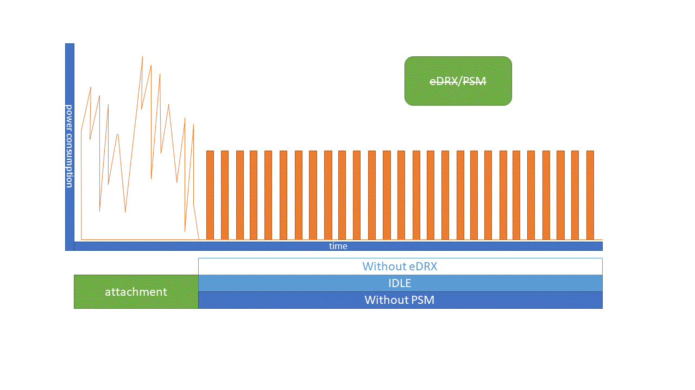

But how do these savings modes fit into the cycle? As expected, both modes are involved in the IDLE stage.
The device will remain in this stage for most of the cycle.

If you activate the eDRX, a new cycle will be established during the IDLE stage,It will be repeated continuously, 
maintaining a resting stage during part of the cycle. With the AT command, you can select both, the total time of the new cycle 
and the time during which the communication takes place.

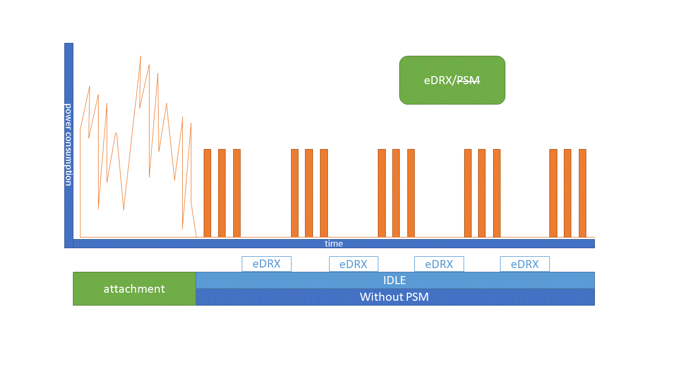

When the PSM is activated, the device will perform the IDLE stage and then turn off the antenna. 
But as we mentioned earlier, every time we connect to the network, attachment will be done again. 
Well! the advantage of the PSM is that when you configured it, the device warns the network  the time it remains deactivated, 
so the network will keep the configuration of the device even if the antenna is off. 
Finally, the device will alert the network again of its connection but without the attachment process, so It saves time and energy.

Using the AT command, it is possible to determine the total cycle time, 
which contains both the IDLE connection time and the workless time.

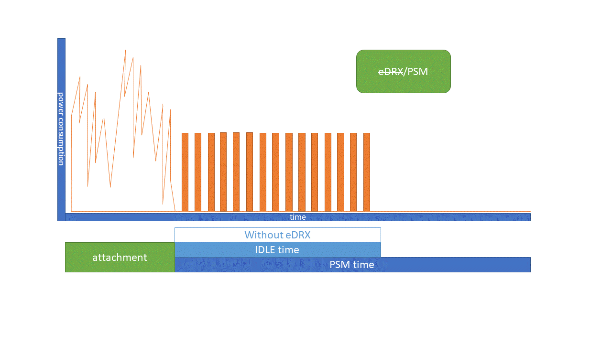

Both saving modes can be combined and used together. This allows you to reduce energy consumption in cases 
where you do not need continuous communication.

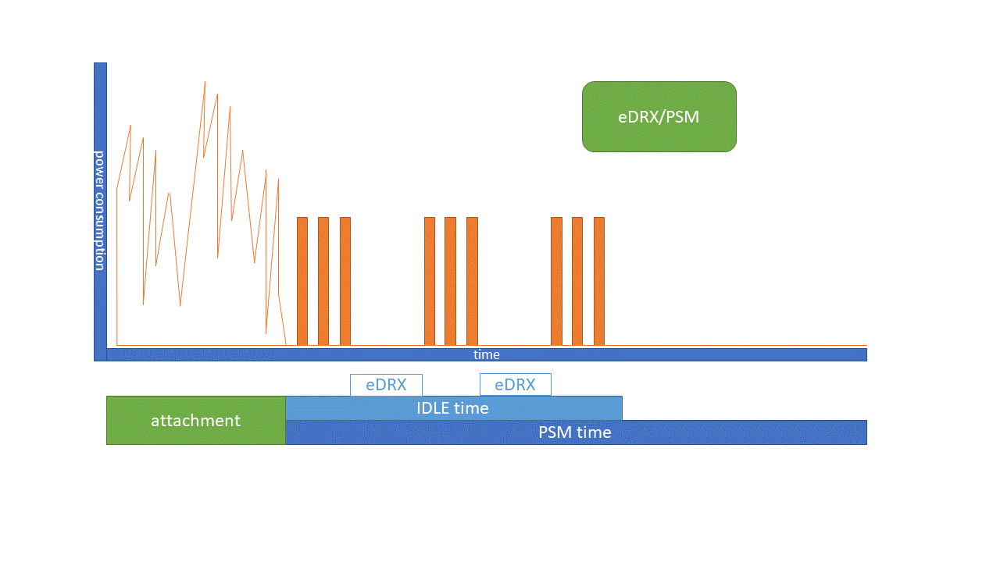


##### How to set the timers:
Although the mode configuration is a negotiation between device and network, 
the network has the final decision, using the AT command you can activate/deactivate both modes 
as well as configure their cycle times. 

###### - eDRX

You can disable it with command `AT+CEDRXS=0,4` in LTE-M or with command `AT+CEDRXS=0,5` for NB-IoT.

Effectively the code 4 or 5 will serve you to identify the type of connection you want to configure!!

To activate it you must do exactly the same thing, but changing the 0 for a 2, 
although this time you will have to add a code of 4 digits to configure the cycle time.
```c
// Activate eDRX: 20,48s in LTE-M
MODEM.sendf("AT+CEDRXS=2,4\"0010\"");

// Activate eDRX: 20,48s in NB-IoT
MODEM.sendf("AT+CEDRXS=2,5\"0010\"");

// Activate eDRX: 40,96s in LTE-M
AT+CEDRXS=2,4,"0011"

// Activate eDRX: 40,96s in NB-IoT
AT+CEDRXS=2,5,"0011"
```

you can check the rest of the values in the table 

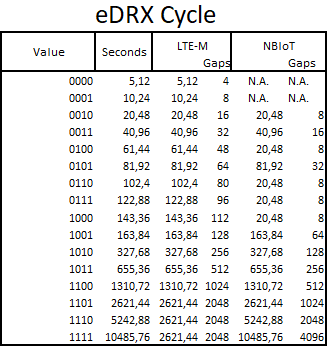

###### - PSM

Disable with command `AT+CPSMS=0`

To activate the PSM, you only have to select the value to one and configure 
the time of the cycle (IDLE + PSM) and time of connection (IDLE) copying the codes from the table. 
```AT
** Activate PSM: 1h of cycle / 5m resting"
AT+CPSMS=1,"00100001","00100101"
```

To complete the code of each timer, select the first 3 digits of the PSM table and complete them 
with the last 5 digits with are the multiplying factor in binary code

follow the example below
```c
//IDLE + PSM:
011 00001 -> 2 sec * 1 = 2 sec
011 00010 -> 2 sec * 2 = 4 sec
101 00010 -> 1 min * 2 = 2 min

//IDLE:
000 00001 -> 2 sec * 1 = 2 sec
001 00010 -> 1 min * 2 = 2 min
```
try with a complete example
```AT
** Activate PSM: 1h of cycle / 5m resting"
//IDLE + PSM:
001 00001 -> 1 hour * 1 = 1 hour
//IDLE:
101 00101 -> 1 min  * 5 = 5 min
//PSM
1hour - 5 min = 55 min

AT+CPSMS=1,"00100001","00100101"
```

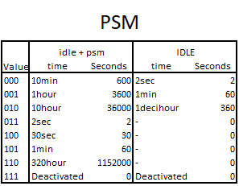

&#x1F4CD;
For the current Arduino board it is not recommended to use the PSM mode. 
The board doesn't have a reset system. If the board is switched off during the PSM, the module will remain off.

```c
// (default and factory-programmed value): disable the use of PSM.
AT+CPSMS=0

// disable the use of PSM and reset all parameters for PSM to factory-programmed values.
AT+CPSMS=2
```

[](#table-of-contents)

### Connection 

Now that you know how to configure your modem to perform a correct connection.

You will be able to execute the following 
[code](https://github.com/telefonicaid/iot-activation/tree/master/scripts/Arduino/Connection) 
with which to connect to the Telefonica network. Let the games begin!

```c
void setup() {
  Serial.begin(9600);
  while (!Serial) {;}
  
  Serial.println("START setup");
  //setup modem Sara R410M
  setup_SaraR410M_movistar();
  
  Serial.println("Testing Modem:");
  IMEI = test_modem();
  Serial.println("Modem's IMEI: " + IMEI);
  
  while (!connected) {
    Serial.println("Try Connecting....");
    if ((nbAccess.begin(PINNUMBER) == NB_READY) && (gprs.attachGPRS() == GPRS_READY) ) {
      connected = true;
      Serial.println("Connected");
    } else {
      Serial.println("Not connected");
      delay(1000);
    }
  }

  Serial.println("END setup");

}
```

With this software test, you will be able to check the connection of your SIM card and check
the access to the NB-IoT network.

Open the Arduino IDE Serial Monitor to check if the connection between the module and the network is correct
```
START setup
Testing Modem:
- Starting modem test...
- Modem is connected
- Checking IMEI...
- Modem is functioning properly
- Resetting modem...
- Modem is functioning properly
Modem's IMEI: xxxxxxxxxxxxxxx
NB-IoT networks scanner
Scanning Networks:
1
Try Connecting....
Connected
END setup
Connected
Connected
[...]
 
```

[](#table-of-contents)

# Tutorials

- [Arduino 1Click](Arduino_1Click.md)
- [Arduino to AWS](Arduino_AWS.md)

[](#table-of-contents)

